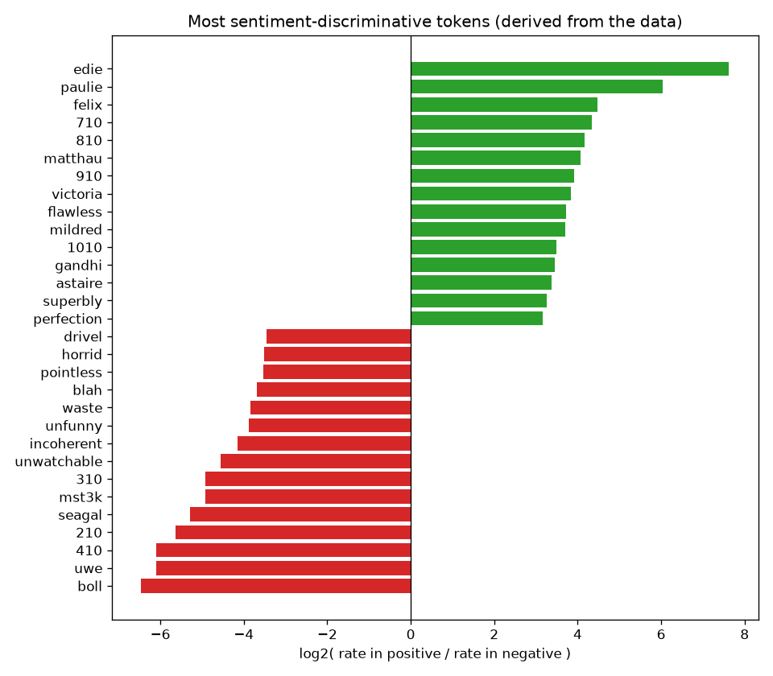
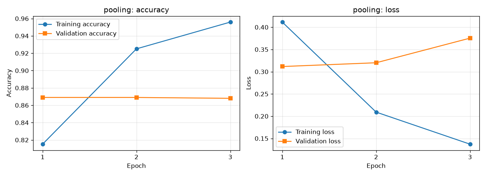
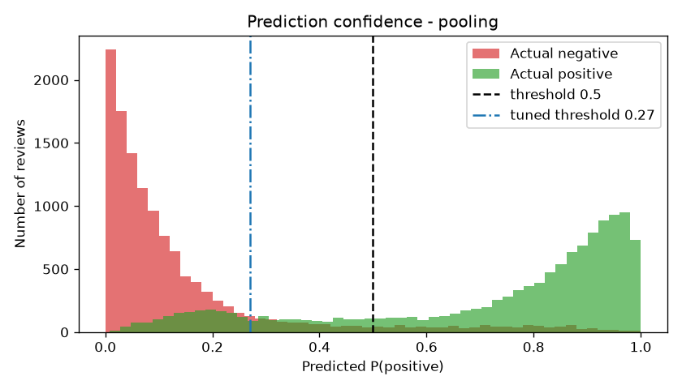

# Neural Movie Review Sentiment Analysis with Explainable Error Analysis

A TensorFlow binary text classifier that reads an IMDB movie review and predicts whether the
sentiment is positive or negative — built as an end-to-end pipeline rather than a single script,
so every stage (exploration, cleaning, vectorization, training, evaluation, error analysis) can be
inspected and explained on its own.

Dataset: [Large Movie Review Dataset](https://ai.stanford.edu/~amaas/data/sentiment/) (aclImdb),
50,000 labelled reviews, Maas et al. (2011).

```
                RAW IMDB DATA
                     |
                     v
             DATA EXPLORATION
                     |
        +------------+------------+
        v            v            v
  Class Balance  Word Count   Word Frequency
        |            |            |
        +------------+------------+
                     v
               TEXT CLEANING
                     v
             TEXT VECTORIZATION
                     v
                 EMBEDDINGS
                     v
           TENSORFLOW CLASSIFIER
                     v
                  MODEL.FIT
                     |
              +------+------+
              v             v
        TRAIN METRICS   VALIDATION
              |             |
              +------+------+
                     v
                TEST DATASET
                     v
        ACCURACY / PRECISION / RECALL / F1
                     v
              ERROR ANALYSIS
                     v
               SAVED ML MODEL
```

## Quickstart

```bash
pip install -r requirements.txt

python src/download_data.py              # fetch + extract aclImdb, drop train/unsup
python src/explore_data.py               # EDA -> reports/eda_summary.md + figures
python src/preprocess.py                 # cleaning / vectorization demo
python src/train.py --model pooling --epochs 15
python src/evaluate.py --model pooling
python src/predict.py --model pooling
python src/train.py --model bilstm --epochs 8      # version 2, the comparison
python src/evaluate.py --model bilstm
python src/evaluate.py --compare-only    # side-by-side table + shared-error overlap
```

`notebooks/analysis.ipynb` is the narrative walkthrough; it reads the artifacts the scripts leave
behind, so run the scripts first.

Everything runs on CPU. Rough timings on a modest laptop: download + extract ~15 min (100,000 tiny
files), EDA ~3 min, pooling model ~1 min/epoch, BiLSTM ~8.5 min/epoch, evaluation ~4 min.

## Project structure

```
sentiment-analysis/
├── data/aclImdb/                     # downloaded dataset (not in git)
├── models/
│   ├── sentiment_model_pooling.keras # saved model, vectorizer included
│   └── sentiment_model_bilstm.keras
├── notebooks/analysis.ipynb
├── reports/
│   ├── eda_summary.md                # class balance, lengths, word stats
│   ├── word_scores.csv               # every token's positive/negative log-ratio
│   ├── history_*.json                # per-epoch metrics
│   ├── metrics_*.json                # final test metrics
│   ├── error_analysis_*.md
│   ├── misclassified_reviews_*.csv   # review | real_label | prediction | confidence
│   └── figures/*.png
├── src/
│   ├── config.py                     # shared paths + hyper-parameters
│   ├── download_data.py              # stage 1
│   ├── explore_data.py               # stages 2 + 4
│   ├── preprocess.py                 # stages 3, 5, 6
│   ├── train.py                      # stages 7-10
│   ├── evaluate.py                   # stages 11-13
│   └── predict.py                    # stage 14
├── requirements.txt
└── README.md
```

## What the data looks like

Each review is one text file; its parent folder (`pos` / `neg`) is the label, so there are exactly
two variables: `text` (X) and `label` (y, with 0 = negative and 1 = positive). IMDB kept only
polarised reviews — negatives scored <= 4/10, positives >= 7/10 — so there is no neutral class.

From `reports/eda_summary.md`:

| Property | Value |
| --- | --- |
| Labelled reviews | 50,000 (25,000 train / 25,000 test) |
| Class balance | exactly 50/50 in both splits |
| Exact duplicate texts | 418 |
| Review length | mean 228 words, median 171, range 4–2,459 |
| Truncated at `SEQUENCE_LENGTH=250` | 29% of reviews |

The dataset being perfectly balanced is what makes plain accuracy meaningful here; on a 90/10 split
a model that always answered "positive" would score 90% while learning nothing.

### The word-frequency analysis found a leak

Tokens are ranked by how much more often they occur in positive than in negative reviews
(log2 of the rate ratio, smoothed, minimum 100 occurrences) — nothing hand-picked:

| Positive-associated | Negative-associated |
| --- | --- |
| flawless, superbly, perfection, wonderfully, captures | unwatchable, incoherent, unfunny, waste, pointless, drivel, atrocious, worst |



Two findings worth more than the obvious sentiment words:

1. **Ratings leak through the cleaning step.** `810`, `910`, `1010` are among the strongest positive
   tokens and `210`, `310`, `410` among the strongest negative ones. They are `8/10` and `3/10`
   written inside the review text, and stripping punctuation glues them into single tokens. The model
   can shortcut to reading the score instead of the prose. That is a genuine caveat for any claim
   about "understanding sentiment", and it is invisible unless you look at the token statistics.
2. **Proper nouns carry sentiment in this corpus.** `boll` and `uwe` (director Uwe Boll), `seagal`
   and `mst3k` are near-perfect negative predictors, while `matthau`, `astaire` and `edie` are
   positive ones. The model is partly learning *which films IMDB reviewers hate*, which will not
   transfer to reviews of films outside the dataset.

## Cleaning and vectorization

`clean_text` lowercases, replaces the `<br />` tags that litter these scraped reviews, strips
punctuation, drops non-ASCII noise (these files contain broken byte sequences), and collapses
whitespace:

```
BEFORE  I absolutely LOVED this movie! <br /><br /> Amazing... 10/10.
AFTER   i absolutely loved this movie amazing 1010
```

It is written with `tf.strings` ops and handed to `TextVectorization(standardize=clean_text)`, so
the same cleaning applies during training *and* inside the saved model at inference time — there is
no way for the two to drift apart.

`TextVectorization` then learns the 20,000 most frequent training tokens and maps each word to an
index (0 = padding, 1 = `[UNK]`), padding or truncating every review to 250 tokens:

```
"This movie was brilliant and the acting was superb"
[11, 17, 13, 506, 3, 2, 109, 13, 886, 0, 0, 0]
```

The vocabulary is adapted on the **training split only**; adapting on validation or test text would
leak information about the data the model is judged on.

## Model

```
raw string -> TextVectorization -> Embedding(20000, 128) -> [pooling | BiLSTM] -> Dense+Dropout -> Dense(1, sigmoid)
```

| | Model A `pooling` | Model B `bilstm` |
| --- | --- | --- |
| Sequence handling | `GlobalAveragePooling1D` (bag of words) | `Bidirectional(LSTM(64))` (reads word order) |
| Trainable params | 2,570,369 | 2,667,137 |

`mask_zero=True` on the embedding tells both the pooling and the LSTM layer to ignore padding, so a
40-word review is not averaged against 210 zeros.

Compiled with `adam` + `binary_crossentropy` + `accuracy`, trained with
`EarlyStopping(monitor="val_loss", patience=2, restore_best_weights=True)`.

## Results

Test set (25,000 reviews) used once, after all decisions were made on validation data.

| Model | Accuracy @0.5 | Precision | Recall | F1 | ROC-AUC | Test loss | Tuned threshold | Accuracy @tuned |
| --- | --- | --- | --- | --- | --- | --- | --- | --- |
| pooling | 0.8532 | 0.9117 | 0.7822 | 0.8420 | **0.9418** | 0.3367 | 0.27 | **0.8679** |
| bilstm | 0.8525 | 0.8923 | 0.8018 | 0.8446 | 0.9360 | **0.3318** | 0.36 | 0.8594 |

Confusion matrix, pooling model at threshold 0.5:

```
                     Predicted
                Negative    Positive
Actual Negative    11,553         947
Actual Positive     2,722       9,778
```

Three findings, none of them "my accuracy is X%":

- **Both models overfit after one epoch.** Training accuracy climbs past 0.95 while validation loss
  rises, so `EarlyStopping` rewinds to epoch 1 in both runs. A 2.5M-parameter embedding memorises
  20,000 reviews almost immediately.

  

- **The 0.5 threshold is the biggest single weakness.** Accuracy 0.853 against ROC-AUC 0.942 means
  the model *ranks* reviews well and simply cuts them in the wrong place: it misses positives
  (recall 0.78) far more often than it invents them (precision 0.91). Choosing the threshold on the
  validation set (0.27) and applying it unchanged to test lifts accuracy to 0.868 — a bigger gain
  than changing the architecture, at zero training cost. Tuning on the test set instead would have
  been cheating, so `evaluate.py` fits the threshold on validation only.

  

  The positive reviews (green) have a long tail reaching down towards 0, while the negatives (red)
  pile up hard against 0 — so moving the cut-off left recovers real positives cheaply.

- **Word order did not pay for itself.** The BiLSTM costs roughly 10x the training time per epoch
  (~8.5 min vs ~50 s here) and lands within 0.1pp of the bag-of-words model. It does produce lower
  test loss and better-calibrated scores, and its recall is 2pp higher, but on this dataset the
  presence of words like *waste* or *flawless* apparently carries nearly all the signal. Sequence
  modelling only starts to earn its cost once negation and sarcasm matter more than vocabulary.

## Error analysis

`evaluate.py` writes every mistake to `reports/misclassified_reviews_<model>.csv`
(`review | real_label | prediction | confidence`), sorted so the most confident failures come first.

| | pooling | bilstm |
| --- | --- | --- |
| Misclassified | 3,669 (14.7%) | 3,688 (14.8%) |
| False positives (neg read as pos) | 947 | 1,210 |
| False negatives (pos read as neg) | 2,722 | 2,478 |
| Mean length: correct vs wrong | 222 vs 266 words | 222 vs 268 words |
| Reviews in the uncertain 0.4–0.6 band | 1,526 | 1,996 |

- **The two architectures fail on the same reviews.** 2,620 identical review texts are wrong in both
  models — 55.8% of their combined unique errors. Those failures live in the data and the features, not in
  the choice of layer, which is exactly why swapping in the BiLSTM moved accuracy by 0.1pp.
  (`python src/evaluate.py --compare-only` reproduces this.)
- **Sarcasm fails**, as expected when sentiment is inferred from vocabulary. The pooling model's most
  confident error (score 1.000, true label negative):

  > "Masterpiece. Carrot Top blows the screen away. Never has one movie captured the essence of the
  > human spirit quite like *Chairman of the Board*. 10/10... don't miss this instant classic."

- **Some of the residual error is label noise, not model error.** Among the BiLSTM's most confident
  mistakes is a review labelled negative that reads "This movie was pure genius... Johnny Depp is
  magnificent... I give it 9.5/10. Rent it today!". No model should get that one "right".
- **Longer reviews are harder** (mean 266 words when wrong vs 222 when right), consistent with both
  the averaging of signal over long text and the 250-token truncation that clips 29% of reviews.

### The same failures on hand-written reviews

`python src/predict.py --model pooling` (scores are P(positive)):

| Review | pooling | bilstm | Verdict |
| --- | --- | --- | --- |
| "This movie was absolutely brilliant. I loved every minute of it." | 0.997 | 0.723 | correct |
| "This was boring, badly written and a complete waste of time." | 0.000 | 0.008 | correct |
| "The film had some good moments but overall it was average." | 0.945 | 0.615 | over-confident |
| "The acting was fine, but the plot made no sense whatsoever." | 0.001 | 0.121 | correct |
| "What a masterpiece. I especially enjoyed wasting two hours of my life." | 0.999 | 0.860 | **wrong (sarcasm)** |
| "Not bad at all - I expected far worse from the trailer." | 0.000 | 0.028 | **wrong (negation)** |

Both models are fooled by the same two sentences, and the pooling model is wildly over-confident
about it (0.999, 0.000) while the BiLSTM at least hedges. That difference in calibration is the one
place where reading word order visibly changed behaviour.

## The questions this project answers

1. **What is sentiment analysis?** Text classification where the target is the writer's attitude;
   here binary — did they like the film.
2. **What does the dataset contain?** 50,000 IMDB reviews as plain-text files, labelled by folder,
   polarised (no neutral reviews), plus 50,000 unlabelled ones that `download_data.py` deletes
   because `text_dataset_from_directory` would read them as a third class.
3. **Is it balanced?** Exactly 50/50 in both splits — verified, not assumed.
4. **How long are the reviews?** Median 171 words, mean 228, max 2,459; 29% exceed the 250-token cut-off.
5. **Which tokens appear frequently?** See the table above, plus `reports/word_scores.csv`; raw
   frequency is dominated by stopwords, so tokens are scored by their positive/negative rate ratio.
6. **How was the text cleaned?** Lowercase, `<br />` removal, punctuation and non-ASCII stripping,
   whitespace collapse — inside the vectorizer, so cleaning ships with the model.
7. **How does text become numbers?** `TextVectorization` maps each token to a vocabulary index and
   pads to a fixed length.
8. **Why embeddings?** Token indices are arbitrary labels, not quantities — index 5,000 is not
   "more" than index 10. An embedding replaces each index with a trainable 128-dimensional vector,
   so words used in similar contexts end up with similar vectors and the network can generalise
   across them.
9. **What is the architecture?** See the diagram above.
10. **Why sigmoid?** Two mutually exclusive outcomes need one number: sigmoid squashes the final
    neuron into (0, 1), read as P(positive), split at a threshold.
11. **Why binary cross-entropy?** It is the loss that matches a single probability output, and it
    punishes confident mistakes much harder than hesitant ones. Accuracy is a step function with no
    useful gradient, so it is reported as a metric but not optimised.
12. **What does `model.fit()` do?** Per batch of 32: forward pass, compute loss, backpropagate the
    gradient of the loss with respect to every weight, let Adam step the weights downhill; repeat
    for every batch, then every epoch.
13. **Training loss?** Error on the data the weights are being fitted to — it almost always falls.
14. **Validation loss?** Error on 5,000 held-out reviews the model never trains on: the honest
    signal while developing.
15. **Is it overfitting?** Yes, from epoch 2 onwards — training accuracy 0.96 against validation
    0.87, with validation loss rising. Early stopping restores the best epoch.
16. **Final test accuracy?** 0.8532 at threshold 0.5, or 0.8679 at the validation-chosen threshold
    of 0.27, for the pooling model; 0.8525 / 0.8594 for the BiLSTM.
17. **What does it misclassify?** Sarcasm, negation, mixed verdicts, long reviews, and some plainly
    mislabelled files — and both architectures fail on the same 2,620 reviews.
18. **What improves it?** Measured here: threshold tuning gained +1.5pp, swapping in a BiLSTM gained
    nothing for 10x the compute. Untested but promising: bigrams via `TextVectorization(ngrams=2)`,
    pretrained embeddings or a fine-tuned transformer, stronger regularisation to delay the
    overfitting, dropping digits to close the rating leak, and a longer sequence cut-off.

## Notes and limitations

- The `810`/`310` rating leak means part of the measured accuracy comes from reading numeric scores
  rather than language. Removing digits during cleaning would be the honest experiment.
- 418 duplicate review texts exist in the corpus; a small number may straddle the train/validation
  split and slightly flatter validation scores.
- Vocabulary and cleaning are English-and-ASCII only.
- Results are from a single seed (`SEED = 42`), not averaged over runs.

## Data credit

Andrew L. Maas, Raymond E. Daly, Peter T. Pham, Dan Huang, Andrew Y. Ng and Christopher Potts.
*Learning Word Vectors for Sentiment Analysis.* ACL 2011.
